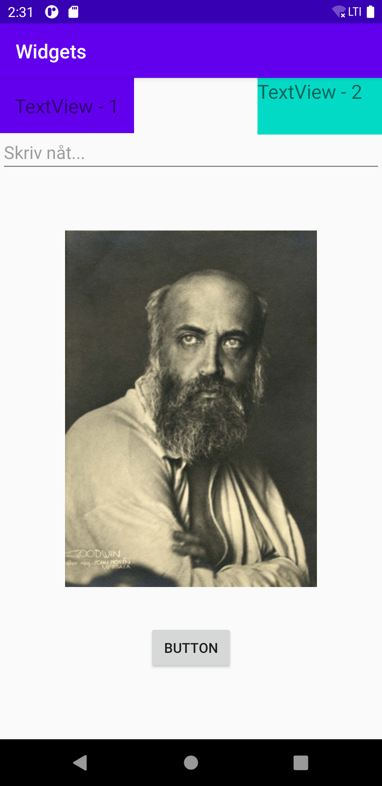

# Rapport

Det första som gjordes efter att jag klonade ner projektet från github var att skapa en linear layout.
Sedan skapade jag två stycken "textviews" som gavs varsitt ID och ett innehåll av "textview-1" och
"textview-2", se kodsnutt nedan. 


```
 <TextView
        android:id="@+id/textView"
        android:layout_width="wrap_content"
        android:layout_height="wrap_content"
        android:background="@color/colorPrimary"
        android:padding="15dp"
        android:text="TextView - 1"
        android:textSize="20sp"
        tools:ignore="MissingConstraints" />

    <TextView
        android:id="@+id/textView2"
        android:layout_width="128dp"
        android:layout_height="58dp"
        android:background="@color/colorAccent"
        android:text="TextView - 2"
        android:textSize="20sp"
        app:layout_constraintEnd_toEndOf="parent"
        tools:ignore="MissingConstraints" />
```

Därefter så skapades en ny widget, en knapp. Jag gav denna widget ett id av "myBtn" och texten 
"Button."
```
<Button
        android:id="@+id/myBtn"
        android:layout_width="wrap_content"
        android:layout_height="wrap_content"
        android:text="Button"
        android:layout_marginBottom="70dp"
        app:layout_constraintBottom_toBottomOf="parent"
        app:layout_constraintEnd_toEndOf="parent"
        app:layout_constraintStart_toStartOf="parent"
        tools:ignore="MissingConstraints" />
```

Sedan för att kolla om jag hade en fungerande knapp så deklarerades en variabel i min onCreate() där
jag använde mig findViewById för att lokalisera det ID som gav till min button. Sedan användes den 
variabeln för att göra en clickListener där något ska hända om en användare klickar på knappen. I detta
fallet använder jag log.d för att få ett meddelande när knappen klickas på. 

```
b.setOnClickListener(new View.OnClickListener() {
            @Override
            public void onClick(View view) {
                Log.d("==>","We clicked on the button");
            }
        });
```

Sedan impoertade jag en bild till programemt som jagkudne använda för attgöra en imageview. Så jag 
lade till en imageview i min main.xml fil och gav den ett ID och en description. 

```
<ImageView
        android:id="@+id/bilden"
        android:layout_width="282dp"
        android:layout_height="366dp"
        android:contentDescription="froding"
        app:layout_constraintBottom_toBottomOf="parent"
        app:layout_constraintEnd_toEndOf="parent"
        app:layout_constraintStart_toStartOf="parent"
        app:layout_constraintTop_toTopOf="parent"
        app:srcCompat="@drawable/enbild" />
```

Sedan när jag skulle placera om mina olika widgets med hjälp av margin så gick jag problem med att 
mina widgets inte gick att flytta på. Alla widget lades på en vertikal rad i mitten av skärmen. 
Jag fick efter ett litet tag rekommendationen att använda mig av en "constraintLayout" istället för
en "LinearLayout" då det tydligen är lite mer meck med att få till det i en LinearLayout. 
Så det jag gjorde då var att gå in i min main.xml fil och konverterade min linearlayout till 
constraintlayout. 

Sedan använde jag mig av Designläget för att placera några av mina widgets genom att fästa "noder" från
bilden till alla fyra sidor av min view, på bilden. På så sätt fick jag bilden fint centrerat i mitten.

Sedan ville jag ha min knapp i mitten en bit under bilden. Detta löstes genom att ge den lite margin
från bottom, enligt kodsnutten nedan kan man se att jag gav min knapp en marginBottom av 70dp. 

```
 android:layout_marginBottom="70dp"
```

Den sista widget som jag lade till i min applikaton är en "EditText" som jag gav en placeholder där 
det står: "skriv nåt...".  Även denna placerade jag som jag ville ha den genom att använda mig av 
design läget i min main.xml fil. 

```
 <EditText
         android:id="@+id/myEdit"
         android:layout_width="match_parent"
         android:layout_height="wrap_content"
         android:hint="Skriv nåt..."
         app:layout_constraintBottom_toTopOf="@+id/bilden"
         app:layout_constraintEnd_toEndOf="parent"
         app:layout_constraintStart_toStartOf="parent"
         app:layout_constraintTop_toTopOf="parent"
         app:layout_constraintVertical_bias="0.485"
         tools:ignore="MissingConstraints" />
```

Nedan visas en screenshot på min färdgiga applikation med alla widgets. 





